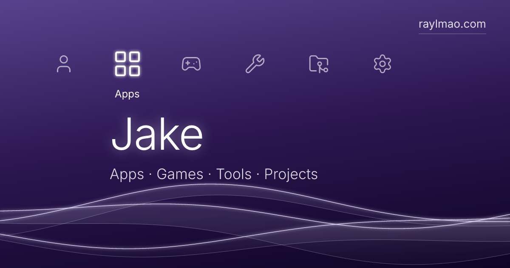

# xmb-hub

The hub for all of Jake's web apps, live at **[raylmao.com](https://raylmao.com)**. Its interface
is an homage to the PS3 XrossMediaBar: a row of categories, a column of items under the selected
one, flowing waves in a color that changes every month, and a keyboard, mouse, touch and game
controller all driving the same menu.



Built with Vite, React and TypeScript, and hosted on Cloudflare Pages. Every sound, icon and
visual is original: no Sony or PlayStation assets, logos, fonts or audio are used, and the site
isn't affiliated with Sony.

## Quick start

```bash
pnpm install
pnpm dev
```

The dev server runs on http://localhost:5180. Node 24 and pnpm 12 are expected (see
`.node-version` and `packageManager` in `package.json`).

| Command             | What it does                                                                  |
| ------------------- | ----------------------------------------------------------------------------- |
| `pnpm dev`          | Dev server with hot reload on port 5180                                       |
| `pnpm build`        | Typecheck and build to `dist/`                                                |
| `pnpm preview`      | Serve `dist/` on port 4180 **with the production security headers**           |
| `pnpm check`        | Typecheck, lint, format check and tests (what CI runs)                        |
| `pnpm test`         | Unit tests (Vitest)                                                           |
| `pnpm format`       | Format everything with Prettier                                               |
| `pnpm images`       | Regenerate the favicons and the share image in `public/`                      |
| `pnpm new-app <id>` | Scaffold a new app next to the hub (see [ADDING_AN_APP.md](ADDING_AN_APP.md)) |

## Adding an app

Adding an app to the hub is one entry in [`src/data/apps.ts`](src/data/apps.ts). The full
workflow, from scaffolding to its own subdomain, is in **[ADDING_AN_APP.md](ADDING_AN_APP.md)**.

## Where things live

| To change                         | Edit                                                               |
| --------------------------------- | ------------------------------------------------------------------ |
| Apps, games, tools and projects   | `src/data/apps.ts`                                                 |
| Category order, names and icons   | `src/data/categories.ts`                                           |
| Bio and links (Home and About)    | `src/data/profile.ts`                                              |
| Site name, intro wordmark, domain | `src/data/site.ts`                                                 |
| Monthly theme colors              | `src/theme/palette.ts` (a test keeps text contrast at WCAG AA)     |
| Available icon names              | `src/icons/icons.ts` (any [Lucide](https://lucide.dev/icons) icon) |
| Menu sounds and music             | `src/audio/sounds.ts`, `src/audio/music.ts`                        |
| Favicon and share image designs   | `scripts/generate-images.ts`, then `pnpm images`                   |

```
src/
  data/         content and config: apps, categories, profile, settings, site
  menu/         turns the config into the category → item tree
  components/   Xmb (menu), Background (WebGL waves), BootIntro, Clock, SidePanel,
                AboutPanel, SettingsPanel, AppViewer (embedded apps), NotFound
  input/        keyboard, wheel, touch and gamepad → one intent model
  audio/        synthesized UI sounds and ambient music (Web Audio, no files)
  theme/        monthly palette, OKLCH color math, theme and motion hooks
  settings/     saved preferences (theme, sound, music, motion)
  router/       / , /app/<id> and not-found
  seo/          robots.txt, sitemap.xml and security headers (generated at build)
scripts/        generate-images.ts, new-app.ts
templates/app/  the starter every new app is scaffolded from
```

## How it works

- **One input model.** Every device is translated into a few intents: move, jump, confirm, back
  and home. A layer stack sends each intent to whatever is on top: the menu, a side panel or
  the app viewer. Mouse hover previews an item in place; clicks open it.

  | Input    | Move                       | Open      | Back                        |
  | -------- | -------------------------- | --------- | --------------------------- |
  | Keyboard | Arrows, Home/End           | Enter     | Esc, Backspace              |
  | Mouse    | Wheel (Shift for sideways) | Click     |                             |
  | Touch    | Swipe                      | Tap       |                             |
  | Gamepad  | D-pad, left stick          | A / Cross | B / Circle (Select in apps) |

- **Menu.** `src/data/*` is turned into a category → item tree by `buildMenu`. Items are
  positioned from two CSS reference lines and moved with transforms only, so transitions stay on
  the GPU. Focus follows the selection so screen readers announce each item.
- **Background.** A single WebGL fragment shader draws three translucent ribbons over a CSS
  gradient. It renders at 75% resolution, caps at 60fps, pauses when the tab is hidden or an app
  is open, and starts only once the browser is idle. Reduced motion shows the gradient alone.
- **Themes.** One OKLCH color per month (September is purple), cross-faded via registered CSS
  custom properties. Settings can pin any color.
- **Sound.** Everything is synthesized with Web Audio: a crisp menu tick, select and back built
  from it, and generative ambient music. Both are off by default, and a hidden tab is always
  silent.
- **Routing.** `/` is the menu, `/app/<id>` opens an embedded app over it (the browser's back
  button closes it), and anything else is a styled 404. `404.html` is also a standalone page, so
  Cloudflare returns a real 404 status.
- **SEO and security.** `index.html` carries the description, canonical URL and share-card
  tags. `robots.txt`, `sitemap.xml` and Cloudflare's `_headers` are generated at build time from
  `src/data/site.ts`, so the domain is defined in exactly one place. The Content Security Policy
  only allows the site's own files, embedded apps on `*.raylmao.com` and Cloudflare Web
  Analytics.

## Deployment

Cloudflare Pages builds the repo on every push:

- **`main`** deploys to production at https://raylmao.com (also https://xmb-hub.pages.dev).
- **Any other branch or pull request** gets a preview at `https://<branch>.xmb-hub.pages.dev`,
  automatically marked `noindex`.

Pages project settings: build command `pnpm build`, output directory `dist`, environment
variable `PNPM_VERSION=12.6.0` (the build image defaults to an older pnpm). Node comes from
`.node-version`.

The domain is registered through Cloudflare. `www.raylmao.com` redirects to the apex with a
Redirect Rule, and Always Use HTTPS is on. GitHub Actions runs `pnpm check` and a build on every
push and pull request.

## Troubleshooting

- **Cloudflare build fails while installing:** check that the `PNPM_VERSION` variable matches
  `packageManager` in `package.json`.
- **Blank page in dev right after editing several files:** on Windows the dev server can miss
  rapid saves. Save the file again or restart `pnpm dev`.
- **An embedded app shows a blank frame:** see Troubleshooting in
  [ADDING_AN_APP.md](ADDING_AN_APP.md).
- **No sound:** turn on Sound or Music in Settings. Browsers only allow audio after a click or
  key press, and the site stays silent while its tab is hidden.

## Credits

Icons from [Lucide](https://lucide.dev) (ISC license). Font: [Inter](https://rsms.me/inter/)
(SIL Open Font License), self-hosted via Fontsource.
